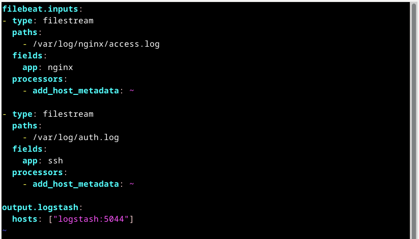

# Домашнее задание к занятию «ELK». Потапчук Сергей

### Инструкция по выполнению домашнего задания

1. Сделайте fork [репозитория c шаблоном решения](https://github.com/netology-code/sys-pattern-homework) к себе в Github и переименуйте его по названию или номеру занятия, например, https://github.com/имя-вашего-репозитория/gitlab-hw или https://github.com/имя-вашего-репозитория/8-03-hw).
2. Выполните клонирование этого репозитория к себе на ПК с помощью команды `git clone`.
3. Выполните домашнее задание и заполните у себя локально этот файл README.md:
   - впишите вверху название занятия и ваши фамилию и имя;
   - в каждом задании добавьте решение в требуемом виде: текст/код/скриншоты/ссылка;
   - для корректного добавления скриншотов воспользуйтесь инструкцией [«Как вставить скриншот в шаблон с решением»](https://github.com/netology-code/sys-pattern-homework/blob/main/screen-instruction.md);
   - при оформлении используйте возможности языка разметки md. Коротко об этом можно посмотреть в [инструкции по MarkDown](https://github.com/netology-code/sys-pattern-homework/blob/main/md-instruction.md).
4. После завершения работы над домашним заданием сделайте коммит (`git commit -m "comment"`) и отправьте его на Github (`git push origin`).
5. Для проверки домашнего задания преподавателем в личном кабинете прикрепите и отправьте ссылку на решение в виде md-файла в вашем Github.
6. Любые вопросы задавайте в чате учебной группы и/или в разделе «Вопросы по заданию» в личном кабинете.

Желаем успехов в выполнении домашнего задания.

---

## Дополнительные ресурсы

При выполнении задания используйте дополнительные ресурсы:
- [docker-compose elasticsearch + kibana](11-03/docker-compose.yaml);
- [поднимаем elk в docker](https://www.elastic.co/guide/en/elasticsearch/reference/7.17/docker.html);
- [поднимаем elk в docker с filebeat и docker-логами](https://www.sarulabs.com/post/5/2019-08-12/sending-docker-logs-to-elasticsearch-and-kibana-with-filebeat.html);
- [конфигурируем logstash](https://www.elastic.co/guide/en/logstash/7.17/configuration.html);
- [плагины filter для logstash](https://www.elastic.co/guide/en/logstash/current/filter-plugins.html);
- [конфигурируем filebeat](https://www.elastic.co/guide/en/beats/libbeat/5.3/config-file-format.html);
- [привязываем индексы из elastic в kibana](https://www.elastic.co/guide/en/kibana/7.17/index-patterns.html);
- [как просматривать логи в kibana](https://www.elastic.co/guide/en/kibana/current/discover.html);
- [решение ошибки increase vm.max_map_count elasticsearch](https://stackoverflow.com/questions/42889241/how-to-increase-vm-max-map-count).

**Примечание**: если у вас недоступны официальные образы, можете найти альтернативные варианты в DockerHub, например, [такой](https://hub.docker.com/layers/bitnami/elasticsearch/7.17.13/images/sha256-8084adf6fa1cf24368337d7f62292081db721f4f05dcb01561a7c7e66806cc41?context=explore).

### Задание 1. Elasticsearch 

Установите и запустите Elasticsearch, после чего поменяйте параметр cluster_name на случайный. 

*Приведите скриншот команды 'curl -X GET 'localhost:9200/_cluster/health?pretty', сделанной на сервере с установленным Elasticsearch. Где будет виден нестандартный cluster_name*.

### Решение

1. Создал [docker-compose.yaml](task-1/docker-compose.yaml) (проброс конфигурационного файла пока закомментировал)


2. Запустил.

3. Скопировал конфигурационный файл из контейнера на хост.

4. Прочитал статус кластера.

5. Остановил.

```
docker compose up -d
docker cp elk-elasticsearch-1:/usr/share/elasticsearch/config/elasticsearch.yml ./elasticsearch.yml
curl -X GET 'localhost:9200/_cluster/health?pretty'
docker compose down
```


6. Раскомментировал проброс конфиграционного файла.


7. Закоментировал строку устанавливающую имя кластера.


8. Запустил.

9. Прочитал статус кластера.

```
docker compose up -d
curl -X GET 'localhost:9200/_cluster/health?pretty'
```


---

### Задание 2. Kibana

Установите и запустите Kibana.

*Приведите скриншот интерфейса Kibana на странице http://<ip вашего сервера>:5601/app/dev_tools#/console, где будет выполнен запрос GET /_cluster/health?pretty*.

### Решение

1. Изменил [docker-compose.yaml](task-2/docker-compose.yaml)


2. Изменил имя кластера в файле elasticsearch.yml


3. Прочитал статус кластера в web-интерфейсе


---

### Задание 3. Logstash

Установите и запустите Logstash и Nginx. С помощью Logstash отправьте access-лог Nginx в Elasticsearch. 

*Приведите скриншот интерфейса Kibana, на котором видны логи Nginx.*

### Решение

1. Изменил [docker-compose.yaml](task-3/docker-compose.yaml)


2. Создал [logstash.conf](task-3/logstash.conf)


3. Запустил


4. Проверил


### Важно

При пробросе только файла access.log Logstash не считывал вновь поступающие данные. Решение - пробросить всю папку с логами.

---

### Задание 4. Filebeat. 

Установите и запустите Filebeat. Переключите поставку логов Nginx с Logstash на Filebeat. 

*Приведите скриншот интерфейса Kibana, на котором видны логи Nginx, которые были отправлены через Filebeat.*

### Решение

1. Изменил [docker-compose.yaml](task-4/docker-compose.yaml)


2. Создал [filebeat.yml](task-4/filebeat.yml)


3. Изменил [logstash.conf](task-4/logstash.conf)


4. Запустил и проверил


---

## Дополнительные задания (со звёздочкой*)
Эти задания дополнительные, то есть не обязательные к выполнению, и никак не повлияют на получение вами зачёта по этому домашнему заданию. Вы можете их выполнить, если хотите глубже шире разобраться в материале.

### Задание 5*. Доставка данных 

Настройте поставку лога в Elasticsearch через Logstash и Filebeat любого другого сервиса , но не Nginx. 
Для этого лог должен писаться на файловую систему, Logstash должен корректно его распарсить и разложить на поля. 

*Приведите скриншот интерфейса Kibana, на котором будет виден этот лог и напишите лог какого приложения отправляется.*

### Решение

Отправим в Elastic логи авторизации с хостовой ВМ.

1. Изменил [docker-compose.yaml](task-5/docker-compose.yaml)


2. Создал [filebeat.yml](task-5/filebeat.yml)



3. Изменил [logstash.conf](task-5/logstash.conf)


4. Запустил и проверил (пришлось дать права на чтение auth.log для всех)


